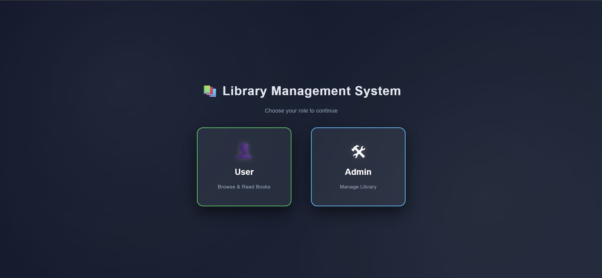
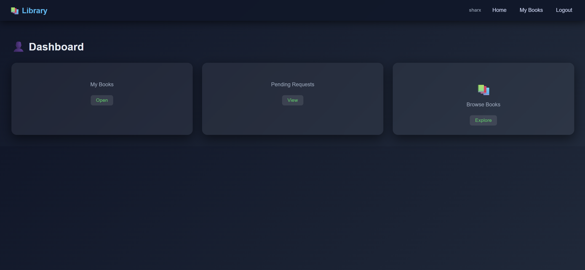
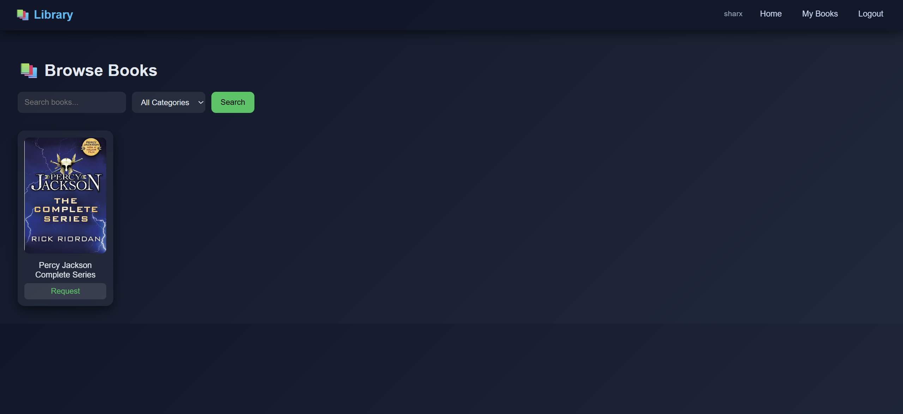
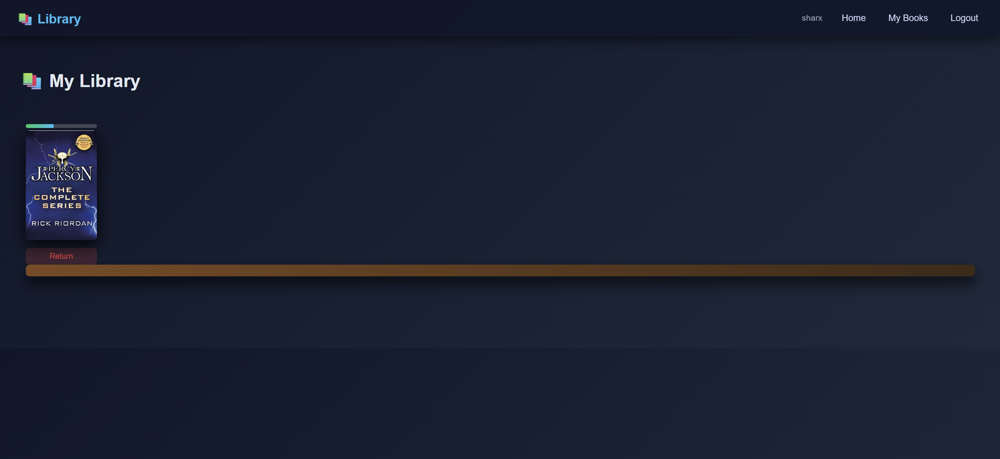
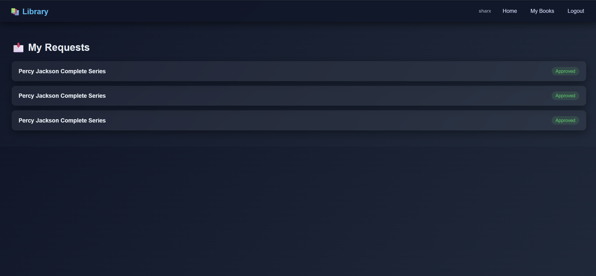
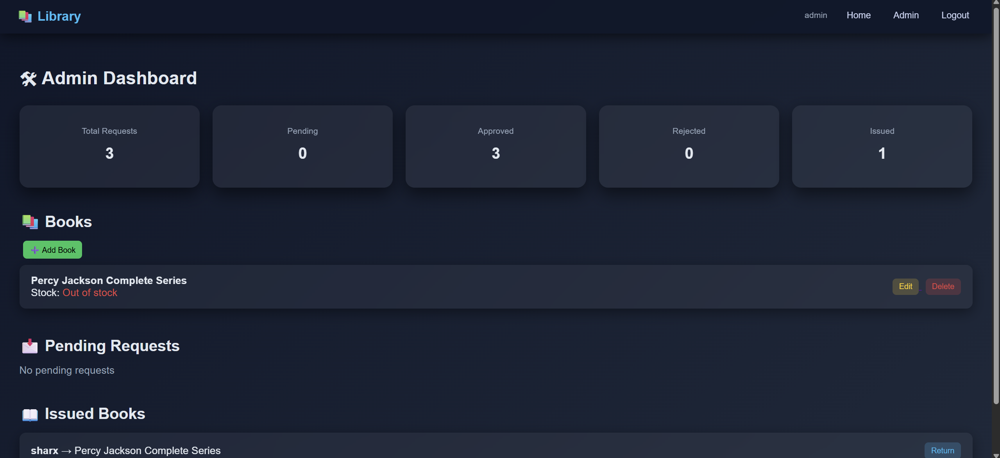
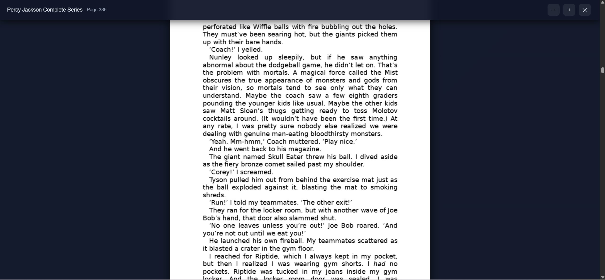

# 📚 Library Management System

A full-stack **Django-based Library Management System** with user/admin roles, book request workflow, and an integrated PDF reader with progress tracking.

---

## 🚀 Features

### 👤 User Side

* User registration with OTP verification
* Login system with role-based access
* Browse books with search & category filters
* Request books
* View request status (Pending / Approved / Rejected)
* Personal library with:

  * Issued books
  * Reading progress tracking
* Built-in PDF reader with:

  * Zoom controls
  * Page tracking
  * Auto-save progress

---

### 🛠 Admin Side

* Admin dashboard with statistics:

  * Total requests
  * Pending / Approved / Rejected
  * Issued books
* Manage books:

  * Add / Edit / Delete
  * Upload cover + PDF
* Handle requests:

  * Approve / Reject
* Issue & return tracking

---

## 🧠 Key Highlights

* 🔐 Role-based authentication (User vs Admin)
* 📖 Custom PDF reader using `pdf.js`
* 📊 Real-time request workflow system
* 📚 Visual “Library Shelf” UI for user books
* 🎨 Modern glassmorphism UI design
* ⚡ Clean and responsive interface

---

## 🛠 Tech Stack

* **Backend:** Django (Python)
* **Frontend:** HTML, CSS, JavaScript
* **Database:** MySQL
* **PDF Rendering:** pdf.js
* **Authentication:** Django Auth + OTP verification

---

## 📸 Screenshots

### 🏠 Role Selection



### 👤 User Dashboard



### 📚 Browse Books



### 📖 My Library



### 📩 Requests



### 🛠 Admin Dashboard



### 📘 PDF Reader



---

## ⚙️ Installation & Setup

```bash
# Clone repository
git clone https://github.com/your-username/library-management-system.git

cd library-management-system

# Create virtual environment
python -m venv venv
source venv/bin/activate   # Windows: venv\Scripts\activate

# Install dependencies
pip install -r requirements.txt

# Apply migrations
python manage.py migrate

# Run server
python manage.py runserver
```

---

## 🔑 Default Admin Access

Create a superuser:

```bash
python manage.py createsuperuser
```

---

## 📌 Future Improvements

* Pagination for large book lists
* Email notifications for approvals
* Fine calculation enhancements
* Mobile responsiveness improvements
* API integration for external book sources

---

## 💼 Project Purpose

This project demonstrates:

* Full-stack Django development
* Role-based system design
* Real-world workflow handling (requests, approvals, issuing)
* UI/UX consistency across multiple pages

---

## 📄 License

This project is open-source and available for learning purposes.
